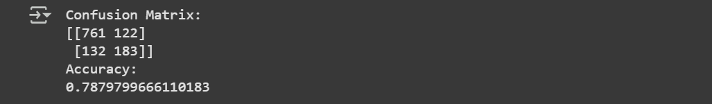
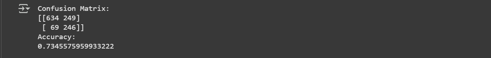

# 📞 Telecom Churn Analysis

A machine learning project to predict customer churn in the telecom industry. This end-to-end analysis explores customer behavior, identifies churn factors, and trains multiple models to predict churn, with a focus on minimizing false positives to align with business priorities.

---

## 🚀 Overview

The project investigates telecom user churn behavior using structured data. It includes cleaning, exploration, feature engineering, and training models such as **XGBoost** and **Support Vector Machine (SVM)**. The evaluation focuses on both accuracy and confusion matrix, with special attention to minimizing false positives — i.e., not missing customers likely to churn.

---

## 🧠 Features

- Conducted **exploratory data analysis (EDA)** to identify churn patterns  
- Preprocessed the data using **label encoding**, **null handling**, and **feature reduction**  
- Applied **SMOTE** to balance the highly imbalanced churn class  
- Trained and compared classification models:  
  - Logistic Regression  
  - Support Vector Machine (SVM)  
  - AdaBoost  
  - XGBoost  
- Evaluated models using **accuracy score** and **confusion matrix**

---

## 🛠️ Tech Stack

- **Language:** Python  
- **Libraries:** Pandas, NumPy, Scikit-learn, Seaborn, Matplotlib, imbalanced-learn, XGBoost  
- **Notebook:** Jupyter / Google Colab  
- **Techniques:** SMOTE, Label Encoding, Feature Selection, Scaling, Classification

---

## 📊 Dataset

- **Source:** `telecom_users.csv`  
- ~5,986 customer records with service, demographic, and billing data  
- Target: `Churn`  
- Key steps:
  - Converted `TotalCharges` to numeric  
  - Filled missing values with mean  
  - Encoded categorical columns  
  - Removed multicollinear features

---

## 📸 Model Results

### 🔹 XGBoost – Highest Overall Accuracy



---

### 🔹 Support Vector Machine – Lowest False Positives

> Preferred for business decision-making



---

## 🧠 Business Takeaways

- **SVM** is most effective at **minimizing false positives**, making it suitable for identifying at-risk customers and prioritizing retention efforts.  
- **XGBoost** has the highest accuracy but more false positives, which could result in unnecessary retention spend.  
- Model selection should consider **business impact**, not just performance metrics.

---

## 📁 How to Run

1. Clone the repository:

```bash
git clone https://github.com/your-username/Telecom-churn-analysis.git
cd Telecom-churn-analysis
